# Пояснения к коду: лабораторная работа 3, вариант 1

Приложение для обработки изображений на C++ с графическим интерфейсом на FLTK.
Вариант 1 включает две части:

1. **Построение и эквализация гистограммы изображения + линейное контрастирование** —
   сравнение двух методов повышения контраста (линейное контрастирование и выравнивание
   гистограммы), а для цветных изображений — сравнение двух подходов к эквализации
   (по каналам RGB и только яркости в пространстве HSV), плюс CLAHE.
2. **Реализация поэлементных операций + линейное контрастирование** — арифметические и
   логические операции над пикселями, гамма-коррекция в сочетании с линейным контрастированием.

В коде намеренно нет комментариев (по условию): всё описание сосредоточено в этом файле.

---

## 1. Сборка и запуск

Требования: CMake ≥ 3.15, компилятор с поддержкой C++11, исходники FLTK 1.4.5 лежат в
`third_party/fltk-1.4.5` (сборка из исходников, отдельно ставить FLTK не нужно).

```bash
cmake -B build -G Ninja \
      -DFLTK_BUILD_TEST=OFF -DFLTK_BUILD_FLUID=OFF \
      -DFLTK_BUILD_FLTK_OPTIONS=OFF -DFLTK_BUILD_HTML_DOCS=OFF
cmake --build build
./build/ImageProcessing                    # графический интерфейс
./build/ImageProcessing photo.png          # интерфейс с сразу открытым файлом
```

В CLion: открыть корень проекта как CMake-проект, собрать и запустить цель `ImageProcessing`.

Помимо GUI есть **консольный режим** для проверки алгоритмов и генерации отчёта:

```bash
./build/ImageProcessing cli <вход> <выход.png> <операция> [ключ=значение ...]
```

Примеры:

```bash
./build/ImageProcessing cli test_images/low_contrast_home.png out.png equalize-hsv
./build/ImageProcessing cli test_images/low_contrast_home.png out.png clahe tiles=8 clip=2
./build/ImageProcessing cli test_images/dark_fruits.png out.png gamma gamma=0.5
./build/ImageProcessing cli test_images/low_contrast_home.png hist.csv hist
```

Операции CLI: `contrast-auto`, `contrast-manual in_min= in_max=`, `equalize-rgb`,
`equalize-hsv`, `clahe tiles= clip=`, `add value=`, `sub value=`, `mul factor=`,
`div divisor=`, `gamma gamma=`, `neg`, `and value=`, `or value=`, `xor value=`, `hist`.
После каждой операции печатаются статистики «до» и «после» (min, max, среднее, σ).

Скрипты:

- `scripts/prepare_test_images.py` — скачивает исходные фото и создаёт базу тестовых
  изображений в `test_images/` (см. раздел 7);
- `scripts/make_report_images.py` — прогоняет ключевые операции через CLI и рисует
  графики гистограмм «до/после» в `Conditions/report_images/` (раздел 8).

---

## 2. Архитектура (три слоя из PDF)

| Слой | Назначение | Файлы |
|---|---|---|
| **1. Presentation (UI)** | только отображение: картинки «до/после», гистограммы, слайдеры, прогресс-бар. Никакой математики обработки | `src/main.cpp`, `src/ui/main_window.*`, `src/ui/image_view.*`, `src/ui/histogram_view.*`, `src/ui/worker.*` |
| **2. Memory & Pixel Access (обёртка буфера)** | сырые байты изображения, адресация пикселей, обработка выхода за границы (Clamp/Reflect) | `src/core/image_buffer.*` |
| **3. Processing (алгоритмы)** | чистые функции: принимают буфер — возвращают новый, ничего не знают о UI | `src/core/processing.*`, `src/core/clahe.*`, `src/core/color.*`, `src/core/parallel.*` |

Вспомогательные файлы: `src/core/image_io.*` (чтение PNG/JPEG/BMP через FLTK, запись PNG),
`src/core/cli.*` (консольный режим), `CMakeLists.txt` (сборка).

Ключевое правило: **обработка идёт только через прямой доступ к памяти** — вложенные циклы
по строкам и указателям (`unsigned char* row = image.row(y)`), без попиксельных вызовов
библиотечных функций вроде GetPixel/SetPixel. Память выровнена, доступ к пикселю —
арифметика по указателю.

---

## 3. Слой 2: `image_buffer` — обёртка над сырыми байтами

Класс `ImageBuffer` (`src/core/image_buffer.h/.cpp`):

- поля `w`, `h`, `ch` (каналы: 1 = серое, 3 = RGB) и `stride` — длина строки в байтах;
- `stride = (w * ch + 3) / 4 * 4` — **выравнивание строки по 4 байтам**. Это:
  - требование формата BMP и многих графических API (строки по границе dword);
  - гарантия, что данные можно отдавать в графические вызовы FLTK без копирования;
- хранилище — `std::vector<unsigned char> data` размера `stride * h`;
- `row(y)` возвращает указатель на начало строки — база для всех циклов обработки;
- `get(x, y, c)` / `set(x, y, c, v)` — адресация пикселя: `data[y * stride + x * ch + c]`;
- статические helpers, изолирующие работу с границами:
  - `clamp_int(v, lo, hi)` — зажим значения в диапазон (используется для насыщения);
  - `clamp_coord(v, size)` — координата пикселя за границей → ближайший граничный
    (стратегия **Clamp / дублирование граничного пикселя**);
  - `reflect_coord(v, size)` — координата за границей → зеркальное отражение
    (стратегия **Reflect**).

Обе стратегии обработки краёв реализованы, как требует PDF; `clamp_coord` применяется
всюду, где алгоритм может выйти за границу (доступ к пикселю, тайлы CLAHE),
`reflect_coord` доступен как альтернатива и используется при обращении к краям.

---

## 4. Слой 3: алгоритмы

### 4.1. `parallel.*` — многопоточность и прогресс

- `struct Progress` — две атомарные переменные: `value` (сколько строк обработано) и
  `total` (всего строк). Рабочий поток увеличивает `value` после каждой строки;
  главный поток GUI читает их каждые 50 мс и двигает прогресс-бар.
- `max_threads()` — число потоков = min(4, число ядер процессора).
- `parallel_rows(rows, threads, fn)` — разбивает диапазон строк на куски и запускает
  `std::thread` на каждый кусок. Каждый поток обрабатывает **свои строки** и не трогает
  чужие — поэтому блокировки внутри алгоритмов не нужны, а `Progress` защищён атомариками.
  Так выполняется требование PDF о параллелизации обработки больших изображений
  (оценка 9–10 баллов).

### 4.2. Гистограмма и статистики (`processing.cpp`)

- `compute_histogram(image, channel, h[256])` — гистограмма: `channel` = 0/1/2 (компонент
  R/G/B) или `-1` — яркость по формуле BT.601: `Y = 0.299·R + 0.587·G + 0.114·B`.
  Гистограмма — массив из 256 корзин, инкремент корзины `h[pixel] += 1` в цикле по пикселям.
- `compute_statistics(image, channel, out[4])` — min, max, среднее и среднеквадратическое
  отклонение σ. σ наглядно показывает, насколько вырос контраст после операции.

### 4.3. Линейное контрастирование

Формула (для каждого пикселя каждого канала):

```
y = clamp((x - a) · 255 / (b - a), 0, 255)
```

где `a` и `b` — границы входного диапазона.

- `linear_contrast_auto` — сначала один проходом по всем каналам находятся глобальные
  `min` и `max` изображения, затем `a = min`, `b = max`: диапазон растягивается на весь
  шкалы 0…255.
- `linear_contrast_manual` — `a` и `b` задаются пользователем слайдерами
  «Контраст min»/«Контраст max» (ручное контрастирование, полезно, когда на изображении
  есть выбросы-«хвосты» гистограммы).

Линейное контрастирование **не меняет форму гистограммы** — она только растягивается:
сохраняются все относительные пики и провалы изображения.

### 4.4. Глобальная эквализация гистограммы

`equalize_channel` — базовая функция, для одного канала:

1. строится гистограмма `h[i]`;
2. считается накопительная сумма `CDF(i) = Σ_{k≤i} h[k]`;
3. `cdf_min` — значение CDF в первом ненулевом бине;
4. строится таблица преобразования (LUT):

```
map[i] = round( (CDF(i) - cdf_min) · 255 / (N - cdf_min) )
```

где `N = width · height` — число пикселей. Если все пиксели одинаковые
(`N - cdf_min = 0`), LUT остаётся тождественной, чтобы изображение не стало чёрным;

5. строка за строкой (параллельно) каждый пиксель заменяется на `map[x]`.

Так как CDF монотонно возрастает, преобразование монотонно: **порядок яркостей
сохраняется**, а распределение становится близким к равномерному — гистограмма
«выравнивается».

Два подхода для цветных изображений:

- **`equalize_rgb`** — `equalize_channel` применяется к каждому из трёх каналов R, G, B
  независимо. Контраст каждого канала растёт максимум, но каналы сдвигаются по-разному →
  **оттенки цвета искажаются** (цветовой сдвиг).
- **`equalize_hsv`** — три прохода:
  1. RGB → HSV (`color.cpp`), берётся только яркость `V` → плоскость `V` (1 канал);
  2. к плоскости `V` применяется обычная эквализация;
  3. HSV → RGB обратно с новой яркостью, оттенок `H` и насыщенность `S` не тронуты.
  Цвета не меняют тон, контраст растёт только по яркости.

### 4.5. CLAHE (`clahe.cpp`)

Contrast Limited Adaptive Histogram Equalization — адаптивная эквализация с ограничением
контраста по скользящему окну (требование PDF для максимальных баллов):

1. изображение делится на сетку тайлов `tiles × tiles` (слайдер «CLAHE тайлы», 2…16);
2. для каждого тайла строятся своя гистограмма и свой LUT по формуле эквализации;
3. **ограничение контраста**: если высота бина превышает порог
   `limit = clip_factor · (пикселей в тайле) / 256`, излишек срезается, а срезанное
   равномерно распределяется обратно по всем бинам (проход «по кругу»). Это мешает
   гистограмме с пиком превращать шум в сплошные плоскости — ограничитель
   «придушивает» усиление шума (слайдер «CLAHE лимит»);
4. значение выходного пикселя вычисляется **билинейной интерполяцией** LUT четырёх
   соседних тайлов: координата пикселя переводится в «тайловые» координаты
   `g = (coord + 0.5) / tile_size - 0.5` (центры тайлов), берутся ближайшие тайлы
   `floor(g)` и `floor(g)+1` с зажимом координат в границы сетки (`clamp_int`) —
   благодаря этому переходы между тайлами не видны как швы;
5. для цветного изображения, как и в эквализации HSV, операция применяется только к
   яркости `V` (RGB→HSV→CLAHE по V→HSV→RGB), чтобы не ломать цвета.

### 4.6. Поэлементные операции (`processing.cpp`)

Все операции — один проход по строкам (параллельно), результат в новый буфер:

| Функция | Формула | Параметр |
|---|---|---|
| `pixel_add_constant` | `y = clamp(x + v, 0, 255)` | «Константа» (с насыщением) |
| `pixel_subtract_constant` | `y = clamp(x - v, 0, 255)` | «Константа» |
| `pixel_multiply_constant` | `y = clamp(round(x · f), 0, 255)` | «Множитель» (0.1…3.0) |
| `pixel_divide_constant` | `y = clamp(round(x / f), 0, 255)` | «Множитель» |
| `pixel_negative` | `y = 255 - x` (эквивалент побитового NOT) | — |
| `pixel_gamma` | `y = 255 · (x/255)^γ` через LUT из 256 элементов | «Гамма» (0.1…3.0) |
| `pixel_and_constant` | `y = x AND mask` (побитово по байту) | «Константа» 0…255 |
| `pixel_or_constant` | `y = x OR mask` | «Константа» |
| `pixel_xor_constant` | `y = x XOR mask` | «Константа» |

Гамма-коррекция использует **таблицу преобразования** (LUT) — `pow` считается 256 раз,
дальше только индексация, что делает операцию быстрой. `γ < 1` изображение осветляет,
`γ > 1` — затемняет.

Насыщение (`clamp` в 0…255) обязательно: без него переполнение байта «заворачивало бы»
значение (255 + 1 → 0) и давало бы белое чёрным.

### 4.7. Цветовые преобразования (`color.cpp`)

`rgb_to_hsv` — классический переход по максимуму/минимуму/дельте компонент:
`V = max(R,G,B)/255`, `S = (max-min)/max`, `H` — сектор 0…360°.
`hsv_to_rgb` — обратный переход через `C = V·S`, `X = C·(1-|H/6 mod 2 - 1|)` и
линейную интерполяцию в секторе. Обе функции работают с `double`, чтобы избежать
накопления ошибок при двукратном преобразовании.

---

## 5. Слой 1: графический интерфейс (`src/ui/`)

### 5.1. `main_window.*` — окно и диспетчер операций

Окно 1280×772, разделено на зоны:

- **меню** (сверху): «Файл» (открыть/сохранить/выход), «Контрастирование»,
  «Гистограмма» (эквализации, CLAHE, обновление графиков), «Поэлементные»,
  «Правка» (применить результат/сброс), «Справка»;
- **панель «До (исходное)»** и **панель «После (результат)»** — картинки с сохранением
  пропорций;
- **гистограмма яркости** — серые столбцы «до», зелёная линия «после» (перерисовывается
  после каждой операции);
- **7 слайдеров**: Контраст min, Контраст max, Гамма, Константа, Множитель,
  CLAHE лимит, CLAHE тайлы;
- **прогресс-бар** и **строка статуса** (после операции показывает «среднее → среднее,
  σ → σ» — числовое подтверждение изменения контраста);
- **кнопки** «Применить результат» и «Сброс».

Модель работы с изображением — три буфера:

- `pristine` — загруженный оригинал (не меняется);
- `current` — над чем сейчас работаем (по умолчанию = оригинал);
- `result` — что вернула последняя операция (справа).

Каждая операция строится **над `current`**, результат кладётся в `result` и показывается
справа. Кнопка «Применить результат» делает `current = result` — так можно
последовательно накапливать операции (например, поэлементная → линейное контрастирование,
как и требует вариант). «Сброс» возвращает `current` к `pristine`.

### 5.2. `worker.*` — фоновая обработка

`Worker` запускает вычисление в `std::thread`:

- `start(job, done)` — `job` выполняется в рабочем потоке, получает указатель на
  `Progress` и возвращает готовый `ImageBuffer`;
- главный поток GUI **не блокируется**: таймер `tick()` вызывается каждые 50 мс,
  читает атомары прогресса, двигает полоску прогресс-бара;
- когда поток завершился, `poll()` присоединяет его и вызывает `done(result)` уже в
  главном потоке — поэтому обновление виджетов безопасно (все вызовы FLTK только из
  главного потока, сам поток не касается UI).

Так интерфейс не «зависает» на больших изображениях (критерий оценки PDF).

### 5.3. `image_view.*` — панель изображения

`ImageView` (наследник `Fl_Widget`) хранит копию байтов изображения и объект
`Fl_RGB_Image`, указывающий на эти байты (с параметром `ld = stride`, поэтому выравнивание
сохраняется). В `draw()` изображение масштабируется с сохранением пропорций и рисуется
внутри рамки; поверх — подпись («До»/«После»). Если изображения нет — рисуется
заглушка «Нет изображения».

### 5.4. `histogram_view.*` — гистограмма

`HistogramView` рисует 256 столбцов нормированной гистограммы (серым — «до», зелёной
ломбой — «после»), оси и подписи 0/255. Данные — два массива по 256 значений,
заполняются функцией `compute_histogram` по яркости.

### 5.5. Загрузка и сохранение (`image_io.cpp`)

- чтение — `Fl_Shared_Image::get()` (встроенные декодеры FLTK для PNG/JPEG/BMP/GIF;
  обязателен вызов `fl_register_images()` — без него FLTK не знает форматы). Данные
  копируются в `ImageBuffer` (преобразование в 1 или 3 канала, α-канал отбрасывается);
- запись — `fl_write_png` напрямую из буфера (передаётся `stride`, выравнивание
  учитывается) — на выходе PNG.

---

## 6. Консольный режим (`cli.cpp`)

Парсит аргументы `cli вход выход операция ключ=значение ...`, загружает изображение,
вызывает те же функции слоя Processing (те же коды, что и в GUI), печатает статистики и
сохраняет PNG. Операция `hist` сохраняет гистограмму яркости в CSV (bin;count).
Режим используется скриптом отчёта и для автоматической проверки корректности.

---

## 7. База тестовых изображений (`test_images/`)

Создаётся командой `python3 scripts/prepare_test_images.py` (исходные фото скачиваются
из открытого репозитория OpenCV, деградации генерируются Pillow):

| Группа | Файлы | Зачем |
|---|---|---|
| исходные цветные | `butterfly`, `fruits`, `home`, `apple` | нормальная картинка для сравнения «до/после» |
| малоконтрастные | `low_contrast_*` (контраст ×0.25) | основной случай для контрастирования и эквализации |
| зашумленные | `noisy_gauss_*` (гауссов шум), `noisy_salt_*` (соли-перцы 5%) | проверка, что CLAHE не усиливает шум так, как обычная эквализация |
| размытые | `blurred_*` (гауссово размытие r=3) | исходный материал для обработки |
| тёмные / светлые | `dark_*` (×0.4), `bright_*` (×1.6) | проверка гамма-коррекции и авто-контраста |
| серые | `gray_*` | работа с одноканальными изображениями |
| градиент | `gradient`, `low_contrast_gradient` | синтетический идеальный случай: равномерная гистограмма после эквализации |

Всего 34 изображения.

---

## 8. Эксперименты: сравнение методов

Все графики и числа ниже получены **наших программой** (скрипт
`scripts/make_report_images.py` гоняет CLI-режим и рисует гистограммы реальных
результатов). σ — среднеквадратическое отклонение яркости, чем оно больше, тем выше
контраст.

| Операция | Изображение | До | После | График |
|---|---|---|---|---|
| Линейное контрастирование (авто) | low_contrast_home.png | min=87 max=150 среднее=115.7 sigma=11.4 | min=0 max=253 среднее=116.0 sigma=46.1 | 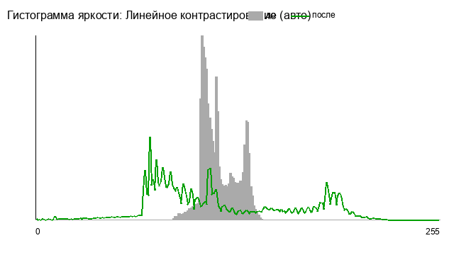 |
| Эквализация по каналам RGB | low_contrast_home.png | min=87 max=150 среднее=115.7 sigma=11.4 | min=1 max=255 среднее=130.4 sigma=62.9 | 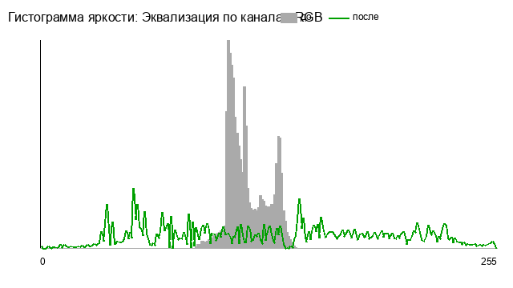 |
| Эквализация яркости HSV | low_contrast_home.png | min=87 max=150 среднее=115.7 sigma=11.4 | min=0 max=254 среднее=120.5 sigma=70.8 | 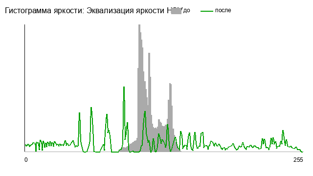 |
| CLAHE (тайлы 8x8, лимит 2) | low_contrast_home.png | min=87 max=150 среднее=115.7 sigma=11.4 | min=65 max=177 среднее=122.1 sigma=18.0 | 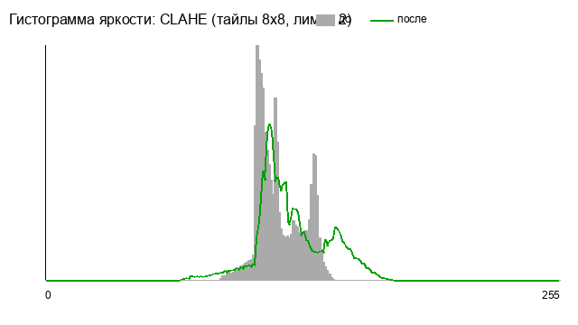 |
| Линейное контрастирование (авто) | low_contrast_butterfly.png | min=84 max=148 среднее=112.7 sigma=17.6 | min=0 max=255 среднее=114.4 sigma=70.1 | 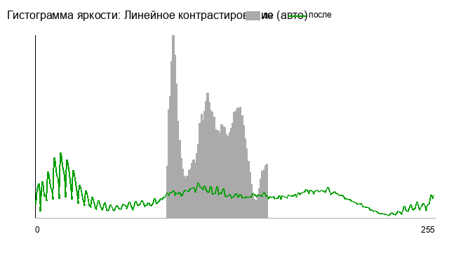 |
| Эквализация по каналам RGB | low_contrast_butterfly.png | min=84 max=148 среднее=112.7 sigma=17.6 | min=0 max=255 среднее=127.5 sigma=72.1 | 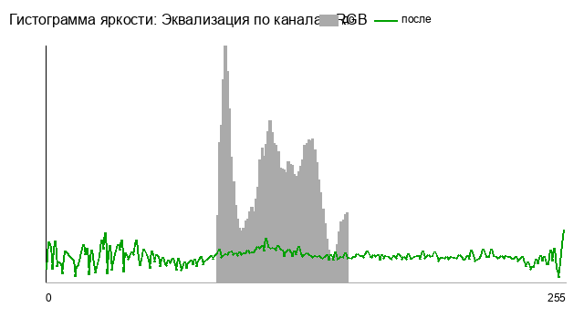 |
| Эквализация яркости HSV | low_contrast_butterfly.png | min=84 max=148 среднее=112.7 sigma=17.6 | min=0 max=255 среднее=124.9 sigma=71.6 | 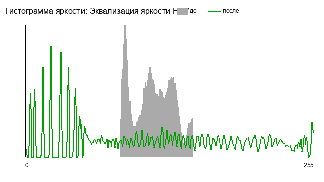 |
| CLAHE (тайлы 8x8, лимит 2) | low_contrast_butterfly.png | min=84 max=148 среднее=112.7 sigma=17.6 | min=62 max=184 среднее=115.5 sigma=28.3 | 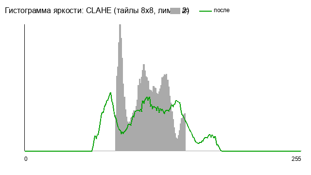 |
| Эквализация яркости HSV на зашумленном | noisy_gauss_home.png | min=0 max=237 среднее=119.1 sigma=35.2 | min=0 max=253 среднее=101.5 sigma=66.5 | 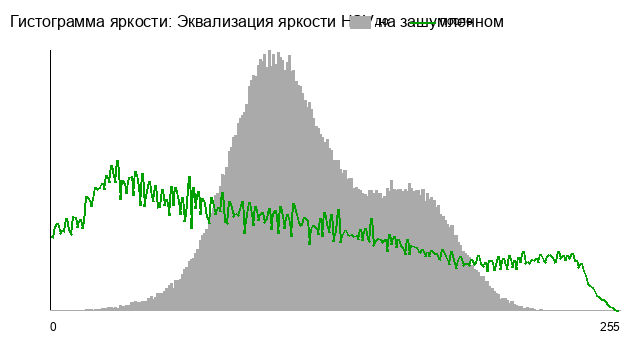 |
| CLAHE на зашумленном (лимит 4) | noisy_gauss_home.png | min=0 max=237 среднее=119.1 sigma=35.2 | min=0 max=253 среднее=105.6 sigma=56.3 | 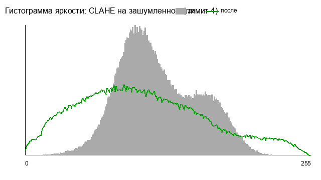 |
| Гамма-коррекция 0.5 | dark_fruits.png | min=0 max=95 среднее=35.1 sigma=18.3 | min=0 max=156 среднее=88.1 sigma=30.4 | 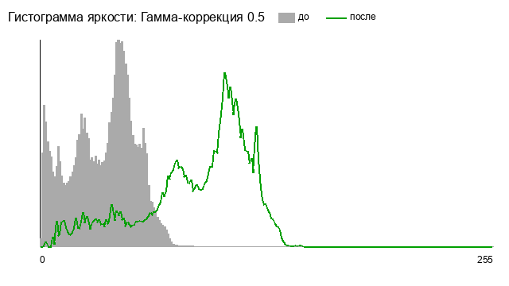 |
| Линейное контрастирование (авто) | dark_fruits.png | min=0 max=95 среднее=35.1 sigma=18.3 | min=0 max=242 среднее=89.4 sigma=46.6 | 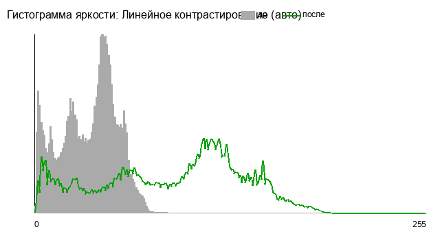 |

### 8.1. Линейное контрастирование против эквализации

На малоконтрастном `low_contrast_home` (σ 11.4):

- **Авто-контраст**: σ 11.4 → 46.1, диапазон растянут на весь шкалы. Форма гистограммы
  сохранена — контраст вырос «ровно» на коэффициент растяжения;
- **Эквализация HSV**: σ → 70.8 — почти в 1.6 раза сильнее: гистограмма не просто
  растянута, а **перераспределена** так, чтобы каждый диапазон яркостей занимал
  равную площадь (см. зелёную кривую — почти горизонтальна);
- практический вывод: линейное контрастирование предсказуемо и не искажает форму
  распределения, эквализация даёт максимальный контраст, но меняет тональный баланс
  (среднее сместилось 115.7 → 130.4 у RGB-варианта).

### 8.2. Эквализация RGB против HSV (цветные изображения)

Оба подхода дают сопоставимый рост контраста яркости (σ 62.9 против 70.8 на home,
72.1 против 71.6 на butterfly), но:

- **RGB** меняет три канала независимо → оттенки сдвигаются (на фотографиях видно
  изменение цветового тона, среднее по яркости выросло сильнее: 115.7 → 130.4);
- **HSV** трогает только яркость → **цвета сохраняются**, σ при этом выше: яркость
  выравнивается эффективнее, потому что работает в одном канале, а не размазывает
  эффект по трём.

Сравнение «до/после» (бабочка, малоконтрастная):

Эквализация RGB: 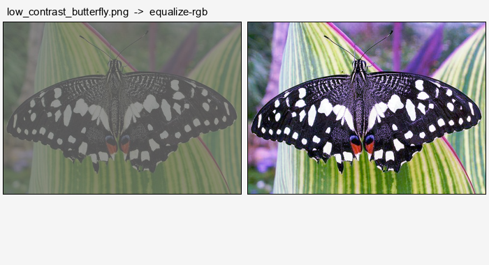

Эквализация HSV: 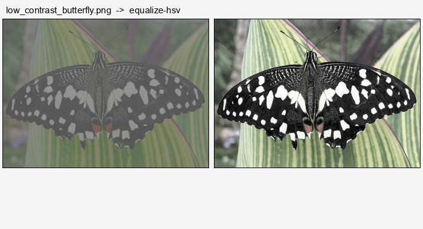

### 8.3. CLAHE против глобальной эквализации

CLAHE **намеренно даёт меньше суммарного контраста** (σ 18.0 против 70.8), потому что
ограничивает контраст локально: каждое пятно изображения выравнивается отдельно, без
перетаскивания яркостей через всё изображение. Зато:

- не выживаются «прожоги» и провалы в однородных областях (min=65 вместо 0 —
  тени не слиплись в чёрное);
- на **зашумленном** изображении разница принципиальна:

Эквализация на шуме: 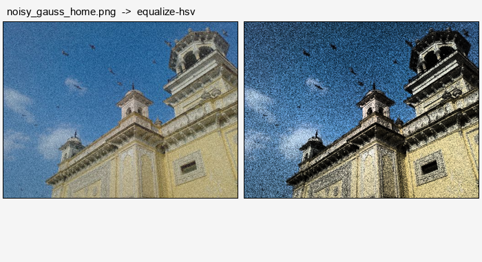

CLAHE (лимит 4) на шуме: 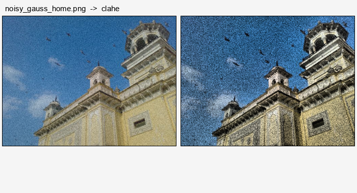

Обычная эквализация подняла σ с 35.2 до 66.5, при этом усилила видимость шума
(шумовые пики в гистограмме разогнаны по всей шкале). CLAHE с ограничителем дал σ 56.3,
но за счёт подрезки пиков шум не получил кратного усиления — картинка стала контрастнее
спокойнее.

Вывод: глобальная эквализация — максимальный эффект на чистых малоконтрастных
снимках; CLAHE — выбор для шумных и неоднородно освещённых изображений.

### 8.4. Гамма-коррекция против линейного контрастирования (тёмное изображение)

На `dark_fruits` (среднее 35.1):

- **Гамма 0.5**: среднее 35.1 → 88.1, σ 18.3 → 30.4 — тени подняты, но шкала
  не растянута до конца (max = 156) — преобразование мягкое, нелинейное, детали в
  тенях видны, света не выбиты;
- **Авто-контраст**: σ → 46.6 и max = 242 — контраст выше, но тёмные области
  прижаты к нулю жёстче (линейный закон).

Гамма удобна, когда надо осветить тени без потери светов; авто-контраст — когда нужен
максимальный размах.

Гамма: 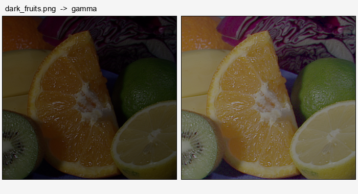

Авто-контраст: 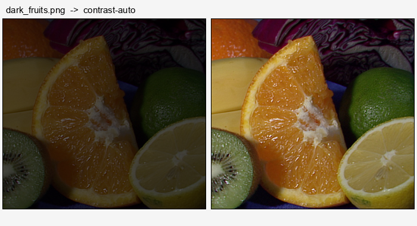

---

## 9. Сборка под Windows XP

Условие сдачи — exe, работающий на Windows XP. Кросс-сборка 32-битным MinGW
(Homebrew `mingw-w64`, компилятор `i686-w64-mingw32-g++`, XP — 32-битная ОС):

```bash
cmake -B build-win32 -G Ninja \
      -DCMAKE_TOOLCHAIN_FILE=cmake/toolchain-mingw32.cmake \
      -DFLTK_BUILD_TEST=OFF -DFLTK_BUILD_FLUID=OFF \
      -DFLTK_BUILD_FLTK_OPTIONS=OFF -DFLTK_BUILD_HTML_DOCS=OFF
cmake --build build-win32
# результат: build-win32/ImageProcessing.exe
```

Файл `cmake/toolchain-mingw32.cmake` задаёт компиляторы MinGW и ключевой флаг
линковки `-mcrtdll=msvcrt-os`.

**Почему `msvcrt-os`.** Современные тулчейны MinGW по умолчанию линкуют **UCRT**
(`api-ms-win-crt-*.dll`) — этих DLL на Windows XP нет (UCRT появился в Windows 10,
для XP существует только отдельный VC-редистрибутив). `msvcrt.dll` же есть на XP
из коробки. Флаг `-mcrtdll=msvcrt-os` заставляет линковаться с `libmsvcrt-os.a` —
импортной библиотекой системного `msvcrt.dll`. Флаг ставится **только при линковке**:
на этапе компиляции он определяет `__MSVCRT_VERSION__=0x700`, из-за чего заголовки
libstdc++ перестают объявлять `quick_exit`/`at_quick_exit` и сборка падает.

В `CMakeLists.txt` для Windows дополнительно:

```cmake
target_compile_definitions(ImageProcessing PRIVATE _WIN32_WINNT=0x0501 WINVER=0x0501)
target_link_options(ImageProcessing PRIVATE -mwindows -static -static-libgcc -static-libstdc++)
```

- `_WIN32_WINNT=0x0501` — целевая версия Windows (XP); без этого заголовки могут
  открывать API, которого в XP нет;
- `-mwindows` — GUI-приложение без консольного окна (подсистема 4.0);
- `-static -static-libgcc -static-libstdc++` — **статическая линковка**: libstdc++,
  libgcc и winpthread вшиты в exe, DLL-версий этих библиотек на машине с XP не нужно;
- FLTK собран из исходников в составе проекта, встроенные JPEG/PNG/ZLIB — внешних
  библиотек нет.

**Проверка зависимостей exe** (`i686-w64-mingw32-objdump -p build-win32/ImageProcessing.exe`):
`PE32 executable (GUI) Intel 80386`, подсистема 4.0, список DLL — только системные,
все присутствуют на XP:

```
KERNEL32.dll  USER32.dll  GDI32.dll  COMCTL32.dll  COMDLG32.DLL  SHELL32.dll
ole32.dll  WINSPOOL.DRV  WS2_32.dll  gdiplus.dll  msvcrt.dll
```

Нет `api-ms-win-crt-*` (UCRT), нет `libstdc++-6.dll`, `libgcc_s_dw2-1.dll`,
`libwinpthread-1.dll`. Импортируемые из `msvcrt.dll` символы — стандартный набор
CRT, доступный в XP (`_beginthreadex`, `_ftime`, `_vsnprintf`, `_lseeki64` и т.п.).
Из `gdiplus.dll` используются только функции GDI+ 1.0 (`GdiplusStartup`, пути,
кисти, перья) — они есть в gdiplus.dll, поставляемом с XP.

**Проверка запуском** под Wine (эмуляция Windows): консольный режим даёт на Windows-exe
те же числа, что и нативная macOS-сборка (например, эквализация HSV:
σ 11.41 → 70.77), PNG сохраняется; GUI-режим с открытым файлом запускается и работает.

---

## 10. Соответствие требованиям PDF

| Требование | Где реализовано |
|---|---|
| Графический интерфейс | `src/ui/*` — окно, меню, слайдеры, прогресс-бар |
| Честный пиксельный доступ (вложенные циклы, указатели) | все функции `processing.cpp`, `clahe.cpp` — циклы по `unsigned char* row` |
| Обработка краёв (≥2 стратегии) | `ImageBuffer::clamp_coord` и `reflect_coord` |
| 3-слойная архитектура | раздел 2 |
| Линейное контрастирование vs эквализация | 4.3, 4.4, эксперименты 8.1 |
| RGB vs HSV эквализация | 4.4, эксперимент 8.2 |
| CLAHE | 4.5, эксперимент 8.3 |
| Поэлементные операции + контрастирование | 4.6, раздел 5.1 (накопление операций) |
| Параллелизация обработки | 4.1, 5.2 |
| База тестовых изображений | раздел 7 |
| Прогресс, гистограммы «до/после», слайдеры | 5.1, 5.4 |
| exe для Windows XP | раздел 9 |
| Сопроводительная документация | этот файл |
